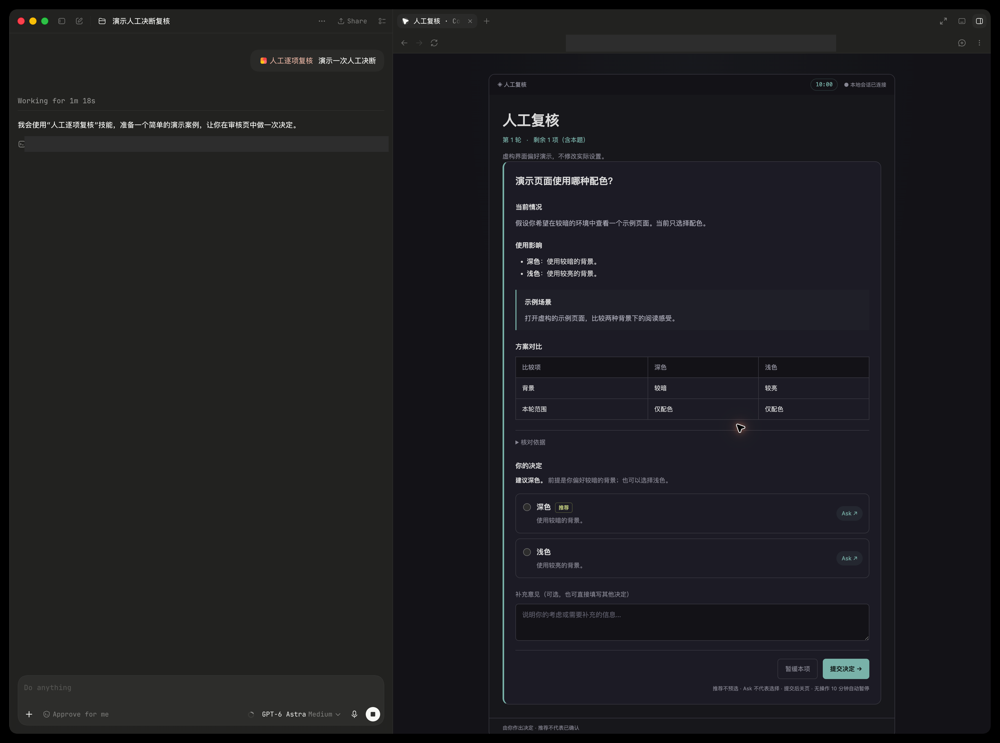
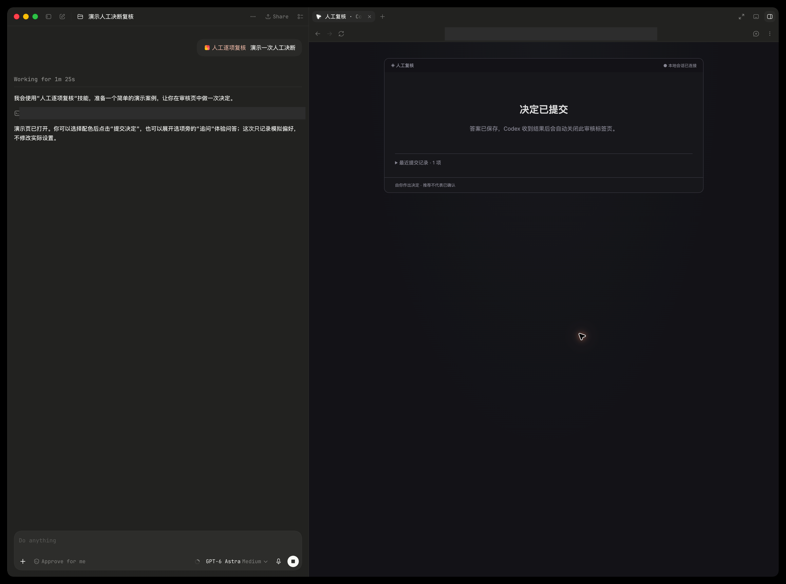

# Codex 富文本人工复核

0.5.2：使用 Codex 内置浏览器面板展示独立富文本审核页，替代原生 Question。Python 标准库服务负责题目、提交和状态保存，skill 负责查证、分支与队列。

灵感来自 **pi-interview**。本插件将逐项人工决策的交互方式应用于 Codex 内置浏览器审核流程。

## 体验

在可访问此目录的 Codex 任务中说：

```text
读取 <插件目录>/skills/human-review/SKILL.md，带我体验富文本人工复核。
```

源码尚未注册到全局插件市场；可手动读取 skill 使用。无 npm 安装、远程服务或 API 密钥需求。

## 演示截图

以下截图展示虚构的界面配色决策，不修改实际设置。图片随仓库保存在 `docs/images/` 中。

### 查看问题并作出决定

审核页集中展示当前情况、使用影响、示例场景和方案对比。用户可选择选项、发起 Ask 追问或填写补充意见，再提交决定；推荐项不会自动选中。



### 决定提交成功

提交后显示“决定已提交”，答案已保存。Codex 收到结果后关闭本题审核标签页，并根据决定继续下一项或结束复核。



## 使用流程

1. 在 `$TMPDIR` 新建独立会话目录。
2. 运行 `python3 scripts/review.py serve --session <目录>`，保持进程运行。
3. 用内置浏览器打开输出的完整 URL。
4. `python3 scripts/review.py publish --session <目录> --file <题目JSON>` 发布单题。
5. 保持当前 Codex 任务运行，用户可在选项中 Ask 继续追问；`python3 scripts/review.py wait --session <目录> --seconds 45` 读取 Ask 或最终答案。Ask 由当前模型回答后以 `respond --file <回答JSON>` 写回；最终提交后由任务关闭对应标签页。
6. Codex 调整队列，发布下一题，或使用 `finish --summary '<结论>'` 完成。

以上相对脚本路径以插件根目录为基准。题目格式见 `skills/human-review/references/question-schema.md`。

## 已支持

- 分区排版、Markdown 子集、代码折叠、对比表格、富选项说明。
- 单选、多选、自由意见、暂缓、历史记录；推荐不预选。
- Pi 风格的居中单列深色卡片，每个选项可展开 Ask，保存多轮追问。
- Ask 沿用当前 Codex 任务的模型与上下文，无独立 API Key 或额外模型配置。
- 最终提交后通过宿主工具关闭绑定标签；Ask 和无效提交不关页。
- 每题打开并执行 `bind-tab` 后发送一次 macOS 系统通知和提示音；重复绑定不重复提醒。
- 10 分钟无操作倒计时，真实 UI 操作重置；轮询与模型回复不重置。
- 超时保存未决状态、关闭绑定标签、结束本轮并提示等待用户处理。
- 提交防重与过期版本检查。
- 本地状态落盘，服务重启可恢复；新启动生成新访问链接。

## 边界

页面在浏览器面板中，不嵌在聊天消息内部。页面事件经本地服务回传。审核期间 Codex 必须保持事件等待，才能处理 Ask 和提交后自动关页；用户中断或宿主结束运行后需发送“继续复核”恢复。应用退出后不保证服务继续运行。

仅绑定 127.0.0.1；浏览器和控制接口使用不同令牌，不将控制令牌暴露到页面。状态文件保存在指定会话目录。这是工作流辅助，不是程序级权限审批系统。

Markdown 仅支持段落、换行、标题、列表、粗体和代码；没有任意 HTML、附件上传或 Mermaid。前端交互为独立实现；布局和色值参考 pi-interview 默认深色主题。

## 验证

`python3 -m unittest discover -s tests -v` 检查答案校验、重复提交、待答覆盖、暂缓与状态恢复。另需在浏览器验证排版、真实提交和发布下一题。自动测试必须使用独立虚构会话，不能替用户提交审核结论。

系统通知依赖 `terminal-notifier`（安装：`brew install terminal-notifier`），点击通知通过 `codex://threads/<任务ID>` 返回对应 Codex 任务及其已有审核面板。服务从 `CODEX_THREAD_ID` 读取当前任务，也可传 `--thread-id`。缺少有效任务 ID 时不发送通知，不回退到会打开脚本编辑器的 osascript。系统权限或专注模式可能抑制横幅，通知失败不会阻断复核。

## 0.5.2 稳定性与资源限制

状态先保存再提交到内存；保存失败不确认决定。通知在状态锁外发送，返回时校验题目版本。活动续时单独写入小型 `activity.json`，重启时按 revision 恢复，因此不再随历史增长反复写入整份记录。

前端串行轮询并设置 10 秒请求超时；内容未变更时仅返回版本和截止时间。页面展示最近 20 项提交记录、当前题的 Ask；完整历史仍保留在 `state.json`，CLI `state` 返回完整记录。历史文件目前不自动清理，长期会话仍应按审核任务拆分。

HTTP 服务最多处理 16 个并发连接，连接读写超时 5 秒；网络回包不持有状态锁。现有服务需停止后用原会话目录重启才会加载新代码，新 URL 替代旧 URL。

回归验证：`PYTHONDONTWRITEBYTECODE=1 python3 -m unittest discover -s tests -v`；`node --test tests/frontend.test.cjs`。
